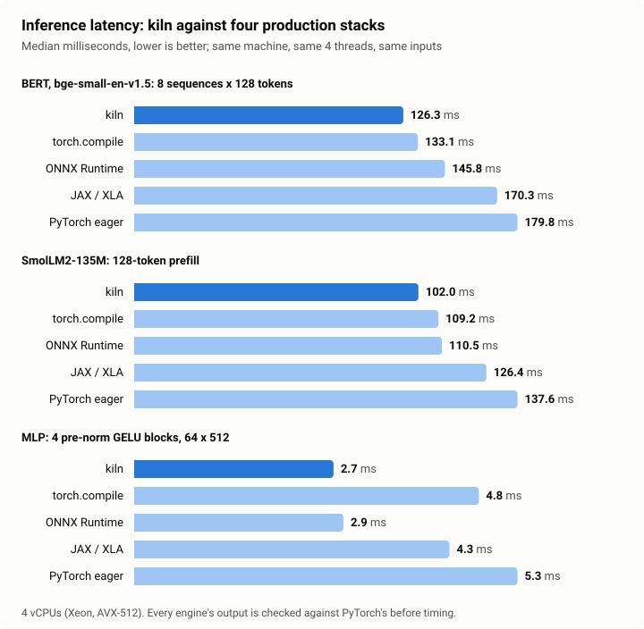
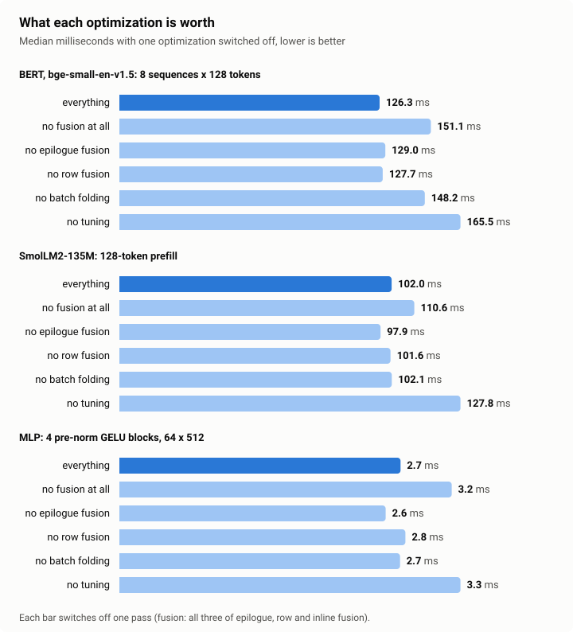
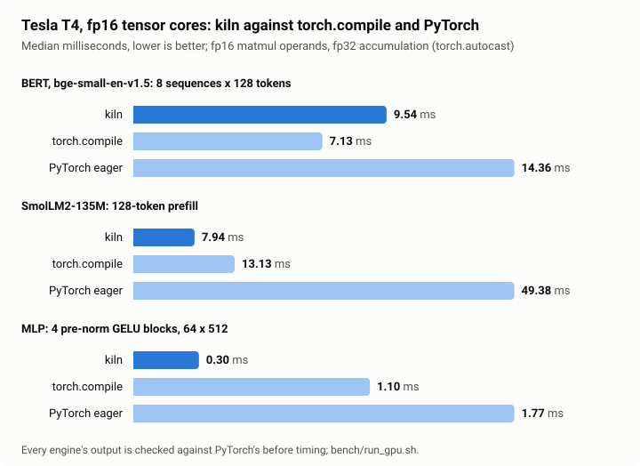
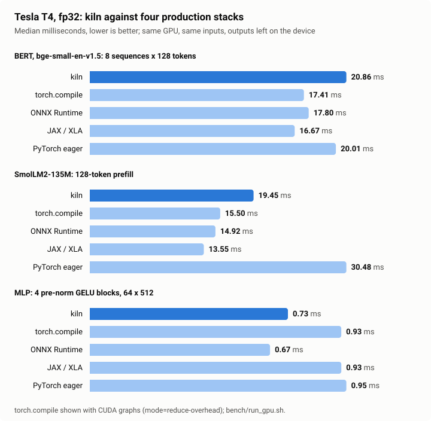

# kiln

An ML compiler written from scratch in Rust, with no dependencies. It reads
a model exported from PyTorch as ONNX, optimizes the graph, fuses it into a
small number of kernels, generates code for them (SIMD C for CPUs, CUDA for
NVIDIA GPUs), compiles that code (the system C compiler; NVRTC, at run
time), auto-tunes the matrix multiplies on the machine it runs on, and
executes the result: the pipeline of XLA, TVM or torch.compile's Inductor,
end to end.

Its output matches PyTorch's. On a 4-vCPU machine it has the lowest median
latency on all three benchmark models, ahead of torch.compile, ONNX
Runtime, JAX/XLA and PyTorch:

- **BERT:** clearly faster.
- **MLP:** clearly faster.
- **SmolLM2-135M:** ahead by 4 to 6%, which is within this machine's
  run-to-run variation.

| Median latency, 4 threads | **kiln** | torch.compile | ONNX Runtime | JAX / XLA | PyTorch |
|---|---|---|---|---|---|
| BERT (bge-small), 8 × 128 tokens | **117.1 ms** | 148.7 ms | 152.7 ms | 188.6 ms | 197.8 ms |
| SmolLM2-135M, 128-token prefill | **115.9 ms** | 122.9 ms | 121.0 ms | 142.1 ms | 146.9 ms |
| MLP, 4 GELU blocks, 64 × 512 | **2.7 ms** | 6.3 ms | 3.3 ms | 5.0 ms | 5.7 ms |

On an NVIDIA T4 with fp16 tensor cores, it runs SmolLM2-135M 1.65× and the
MLP 3.7× faster than torch.compile, and BERT 1.34× slower. In fp32 on the
same GPU it is behind the fastest engine on every model: by 9% (MLP, ONNX
Runtime) to 44% (SmolLM2, JAX/XLA). See [GPU](#gpu).

| Median latency, Tesla T4, fp16 matmuls | **kiln** | torch.compile | PyTorch |
|---|---|---|---|
| BERT (bge-small), 8 × 128 tokens | 9.54 ms | **7.13 ms** | 14.36 ms |
| SmolLM2-135M, 128-token prefill | **7.94 ms** | 13.13 ms | 49.38 ms |
| MLP, 4 GELU blocks, 64 × 512 | **0.30 ms** | 1.10 ms | 1.77 ms |

## Results



Margins over the next-fastest engine:

| Model | Next-fastest engine | kiln's margin |
|---|---|---|
| BERT | torch.compile | 27% |
| MLP | ONNX Runtime | 22% |
| SmolLM2 | ONNX Runtime | 4% |

Over JAX/XLA the margins are 23 to 82%, and over PyTorch eager 27 to 111%.
Each cell is the median of 60 timings (300 for the MLP), taken in three
rounds.

The SmolLM2 margin is too small to call a win. The machine was noisy
during this run: one engine's per-round median on SmolLM2 ranged from 108
to 132 ms. kiln was ahead of ONNX Runtime in only one of the three rounds.
An earlier run of the same benchmark, on the code before boolean lifting
(commit `3a2fecf`), measured kiln at 102.0 ms against 109.2 ms for
torch.compile and 110.5 ms for ONNX Runtime. BERT's margin grew from 5% to
27% in this run. Lifting its attention mask into compiled kernels
accounts for part of that; the machine's noise is the rest.

kiln's compiled form of each model:

| | MLP | BERT | SmolLM2-135M |
|---|---|---|---|
| ONNX nodes as exported | 54 | 568 | 3,402 |
| after folding and canonicalization | 76 | 674 | 1,929 |
| kernels (distinct C functions) | 12 (3) | 135 (12) | 422 (13) |
| matmuls with fused epilogues | 8 of 8 | 84 of 96 | 120 of 271 |
| intermediates / memory-planned arena | 3.3 / 0.8 MB | 381 / 16 MB | 179 / 26 MB |

A matmul keeps a plain store when nothing elementwise reads its product
at the same index: BERT's attention probabilities times values go straight
into the next matmul through a head-merging transpose; in SmolLM2 the
query and key projections are read by rotary embeddings at shifted
indices (that work goes into row kernels), the value and
attention-output products feed further matmuls, the gate projection is
read by the up-projection's epilogue (which computes SiLU(gate) × up), and
the vocabulary projection is the model's output.

All runs: `bench/run.sh` (rounds interleave every engine so that slow
periods of the machine hit all of them; the tables are medians of every
timing, raw data in `bench/results/runs.jsonl`, summary in
`bench/results/summary.md`). Machine: 4 vCPUs of an
Intel Xeon (Cascade Lake, AVX-512), 15 GB RAM, every engine limited to 4
threads. Models in float32; the same inputs for every engine, whose output
is compared with PyTorch's before it is timed. Baselines: ONNX Runtime
1.30 (all graph optimizations), PyTorch 2.14 eager and `torch.compile`
(Inductor, C++ backend), JAX 0.10 (`jax.jit`, XLA CPU) running the same
networks written in JAX over the same weights.

### What each optimization is worth



| Median latency | MLP | BERT | SmolLM2-135M |
|---|---|---|---|
| everything | 2.7 ms | 117.1 ms | 115.9 ms |
| no tuning (a fixed default schedule) | 3.8 ms (1.41×) | 154.8 ms (1.32×) | 141.9 ms (1.23×) |
| no fusion at all (every node its own kernel) | 3.3 ms (1.22×) | 150.9 ms (1.29×) | 124.0 ms (1.07×) |
| no batch folding | 3.3 ms (1.20×) | 133.7 ms (1.14×) | 109.7 ms (0.95×) |
| no epilogue fusion | 3.0 ms (1.09×) | 117.9 ms (1.01×) | 114.7 ms (0.99×) |
| no row fusion | 2.9 ms (1.07×) | 120.7 ms (1.03×) | 116.0 ms (1.00×) |

- **Auto-tuning** is worth 23 to 41%.
- **Fusion as a whole** is worth 7 to 29%.
- **Batch folding** puts BERT's batch into one tall matmul and is worth
  14% there.

Batch folding cannot apply to the MLP or SmolLM2: they have no batch
dimension shared by a weight. For those models, "no batch folding"
compiles to the same code as "everything", so its row measures the noise.
It came out at 1.20× (MLP) and 0.95× (SmolLM2) on identical code, so
differences of that size mean nothing here.

Switching off epilogue or row fusion *alone* stays inside that noise. The
other fusions pick up much of the work: with epilogue fusion off, the
bias, activation and residual still fuse into row kernels. Per kernel, profiling shows the effect directly: the MLP's four
up-projections take 1.40 ms with GELU fused into them, against 1.27 ms
plus 0.23 ms for four separate GELU kernels (`--profile`).

### Compilation

With an empty code cache and tuned schedules available, compiling takes
0.74 s (MLP), 1.33 s (BERT) and 1.86 s (SmolLM2-135M), of which the C
compiler is 0.60, 1.21 and 1.12 s; identical kernels are compiled once.
Tuning is a one-time cost per CPU: 22 s, 105 s and 60 s for the matmul
shapes of the three models.

## GPU

The GPU backend compiles the same fusion plan to CUDA C++, compiles that
with NVRTC at run time and runs it through the CUDA driver API; both
libraries are loaded with `dlopen`, so kiln still has no dependencies.
All numbers below are from a Tesla T4 (Turing, sm_75) on Google Colab.

### fp16 tensor cores



With `--half`, kiln runs matrix multiplies on the tensor cores with fp16
operands and fp32 accumulation; everything else stays in fp32. The
baselines run the same way under `torch.autocast(float16)`.

| Median latency | **kiln fp16** | torch.compile fp16 | PyTorch fp16 |
|---|---|---|---|
| BERT (bge-small), 8 × 128 tokens | 9.54 ms | **7.13 ms** | 14.36 ms |
| SmolLM2-135M, 128-token prefill | **7.94 ms** | 13.13 ms | 49.38 ms |
| MLP, 4 GELU blocks, 64 × 512 | **0.30 ms** | 1.10 ms | 1.77 ms |

kiln is 3.7× faster than torch.compile on the MLP and 1.65× on SmolLM2,
and 1.34× slower on BERT. Its fp16 runs are also faster than every fp32
engine on the MLP and SmolLM2. On BERT, 31% of kiln's fp16 time is
attention (the scores matmul, softmax and values matmul), which runs as
three kernels (see below).

Part of kiln's fp16 lead comes from how the baselines run. Under
autocast, PyTorch keeps the weights in fp32 and converts them on every
call. kiln converts the weights once, when it loads the model. Casting the
model to fp16 ahead of time (`model.half()`) would avoid that cost, but it
also moves more operations to fp16, so it is not the same computation. It
was not measured.

### fp32



| Median latency | kiln | torch.compile | torch.compile, CUDA graphs | ONNX Runtime | JAX / XLA | PyTorch |
|---|---|---|---|---|---|---|
| BERT (bge-small), 8 × 128 tokens | 20.86 ms | 17.35 ms | 17.41 ms | 17.80 ms | **16.67 ms** | 20.01 ms |
| SmolLM2-135M, 128-token prefill | 19.45 ms | 16.02 ms | 15.50 ms | 14.92 ms | **13.55 ms** | 30.48 ms |
| MLP, 4 GELU blocks, 64 × 512 | 0.73 ms | 1.08 ms | 0.93 ms | **0.67 ms** | 0.93 ms | 0.95 ms |

kiln does not win in fp32. On the MLP it is second, 9% behind ONNX Runtime
and ahead of torch.compile, JAX and PyTorch. On BERT it is the slowest, 25%
behind JAX/XLA. On SmolLM2 it is 44% behind JAX/XLA and ahead only of
PyTorch eager.

The reason is matrix-multiply throughput. In fp32, 91 to 96% of kiln's
time is spent in matmuls (per-kernel profile, `--profile`). Measured alone,
its tuned fp32 matmuls reach 0.7 to 4.0 TFLOPS, at most half of the T4's
8.1 TFLOPS peak. The other engines run their matmuls through NVIDIA's
cuBLAS. Tensor cores change this: the same shapes in fp16 reach up to 10.3
TFLOPS, and fp16 runs end to end 2.2 to 2.5× faster than kiln's own fp32
runs.

### What each optimization is worth on the GPU

| Median latency, fp32 | MLP | BERT | SmolLM2-135M |
|---|---|---|---|
| everything | 0.73 ms | 20.86 ms | 19.45 ms |
| no tuning (a fixed default schedule) | 1.25 ms (1.70×) | 23.37 ms (1.12×) | 28.72 ms (1.48×) |
| no fusion at all (every node its own kernel) | 0.85 ms (1.15×) | 29.92 ms (1.43×) | 21.56 ms (1.11×) |
| no CUDA graphs | 0.72 ms (0.98×) | 20.78 ms (1.00×) | 20.10 ms (1.03×) |
| no fused attention | 0.71 ms (0.97×) | 20.73 ms (0.99×) | 19.68 ms (1.01×) |

- **Tuning** is worth 12 to 70%.
- **Fusion** is worth 11 to 43%. Unfused, BERT runs 571 kernels instead
  of 135.
- **CUDA graphs** make no measurable difference. At these sizes the GPU is
  busy long enough to hide the cost of launching kernels one by one.
- **Fused attention** makes no difference because it is never used. kiln
  has a fused attention kernel (scores, softmax and values in one kernel),
  and for each attention shape the tuner times it against the
  three-kernel path. On the T4 it chose three kernels every time, for
  both models and both precisions. The fused kernel passes the tests in
  every tile shape the tuner can pick, but on this GPU it is not faster.

### Compiled form on the GPU

| | MLP | BERT | SmolLM2-135M |
|---|---|---|---|
| kernels (distinct CUDA functions) | 12 (3) | 135 (12) | 422 (13) |
| generated CUDA, fp32 / fp16 | 440 / 450 lines | 888 / 905 lines | 965 / 1,023 lines |
| NVRTC compile, fp32 | 0.49 s | 1.38 s | 2.30 s |
| host steps | 0 | 1 | 1 |
| device memory for intermediates | 0.8 MB | 16.3 MB | 25.5 MB |

- **Tuning** happens once per GPU model and precision and is cached: 33 s
  to 2.3 min per model on the T4.
- **Compiling with cached kernels** takes 0.2 to 1.7 s.
- **Host steps:** the one left in BERT and SmolLM2 is an integer gather
  that takes under a microsecond. BERT's attention mask is boolean and
  integer logic, but it is compiled into the kernels; it does not run on
  the host.

### Method

- **Runs:** `bench/run_gpu.sh`, driven by `scripts/colab.sh`, which also
  runs the GPU test suite on the GPU first. Raw timings are in
  `bench/results/gpu_runs.jsonl` and the summary in
  `bench/results/gpu_summary.md`. The Colab report, with the tuner's
  choices and per-kernel profiles, is in
  `bench/results/gpu_colab_report.txt`.
- **Rounds:** three rounds interleave every engine and configuration, in
  an order rotated each round. Each cell is the median of 150 timings
  (600 for the MLP).
- **Timing:** inputs are already on the GPU, and each timing is one call
  plus waiting for the device. Every engine's output is compared with
  PyTorch's before it is timed.
- **Baselines:**
  - PyTorch 2.11 (CUDA 12.8): eager and `torch.compile`, with and without
    CUDA graphs (`mode="reduce-overhead"`);
  - ONNX Runtime 1.23 with the CUDA execution provider and I/O binding;
  - JAX 0.11 running the same networks written in JAX.
- **Full fp32:** the T4 has no TF32, so every fp32 engine computes in full
  fp32.
- **Noise:** Colab GPUs are shared virtual machines. Run-to-run variation
  of a few percent is common.

## Correctness

| Check | Against | Result |
|---|---|---|
| ONNX import and the reference interpreter | PyTorch's outputs on the three benchmark models | max difference 2.1e-6 (MLP), 2.7e-7 (BERT), 1.7e-4 (SmolLM2 logits, largest 34.6) |
| Optimized graph (folding, canonicalization) | the same | the same tolerances |
| Fused plan, evaluated directly from the kernel IR | PyTorch, tiny MLP, BERT and Llama models (random weights, in CI) | within 1e-5 of the largest output |
| Generated native code | PyTorch on the benchmark models | 2.1e-6, 2.7e-7, 2.1e-4; for comparison ONNX Runtime differs from PyTorch by 9.5e-7, 2.1e-7, 9.5e-5 |
| Generated code with each optimization switched off, and under pseudo-random matmul schedules | PyTorch, tiny models, 8- and 16-lane vectors (CI) | within 1e-5 of the largest output |
| Index simplifier (division factoring, recombination) | integer arithmetic, sampled across each variable's range | identical |
| Memory planner | 200 random sets of lifetimes | no two live buffers overlap |
| GPU kernels on the T4, fp32 | PyTorch on the benchmark models | 2.1e-6, 1.8e-7, 2.0e-4 (torch.compile on the same GPU: 9.5e-7, 1.9e-7, 9.2e-5) |
| GPU kernels on the T4, fp16 matmuls | the same | 7.3e-4, 1.2e-4, 7.7e-2 (torch.compile under autocast: 1.2e-3, 1.5e-4, 1.7e-1) |
| GPU kernels with each optimization switched off; with every matmul schedule in the tuner's space, split-K over 1 to 3 slices and every row-kernel width; with fused attention in every tile shape; in fp32 and fp16 | PyTorch, tiny models, on the T4 and on kiln's emulator of the CUDA execution model (CI) | within 1e-5 of the largest output (2e-3 with fp16 matmuls) |
| Generated CUDA | NVRTC for sm_75 (T4) and sm_80 (A100) | every kernel compiles; default schedules do not spill registers (CI) |

## How it works

**Import.** A protobuf wire-format decoder reads the ONNX file into kiln's
graph IR: named values with types, static shapes and, where known,
constant contents.

**Graph passes.** Shape and type inference runs in topological order
together with constant folding: any node whose inputs are all known, and
any `Shape` of a value with a known shape, is evaluated at compile time by
the reference interpreter. With static input shapes, the shape arithmetic
exporters emit disappears, and so does any mask that does not depend on
the inputs, such as SmolLM2's causal mask: 1,593 of SmolLM2's 3,402 nodes. Canonicalization then rewrites the graph into a small core set:
`Gemm` becomes `MatMul` and `Add`; `Softmax`, `LayerNormalization` and
`ReduceL2` are decomposed into last-axis reductions and elementwise
operations (fusion puts them back together as single kernels, as XLA
does); `Flatten`, `Squeeze` and `Unsqueeze` become `Reshape`. Dead code is
removed.

**Fusion.** Every value is either a *root*, written to memory, or *inline*,
recomputed inside whichever kernel reads it. Roots are matrix multiplies,
reductions, graph outputs, values read more than once, and values a matmul
reads. Data movement (reshape, transpose, slice, concat, tile, expand) is
never materialized: it becomes index arithmetic in its readers. Kernels:

- a **matmul with its epilogue**: the chain of elementwise roots that alone
  consume the product (bias, GELU, residual add, attention scale and mask)
  is computed in registers, intermediate links as temporaries, before a
  single store;
- **row kernels**: consecutive elementwise operations and last-axis
  reductions over the same rows become one kernel, one row per task, with
  row-local scalars and buffers for values nothing else reads; softmax,
  layer norm and RMSNorm are each a single pass;
- **batch folding**: a matmul whose weight is shared across a batch becomes
  one tall matmul when its operands stay affine in the folded row index;
- host steps for the little integer and boolean work left (attention-mask
  construction, token lookups).

**Index arithmetic.** Kernel IR indices are affine forms over loop
variables plus floor-division and remainder atoms, kept canonical by a
simplifier that knows every variable's range. It splits divisions when the
remainder provably stays in range, factors through common divisors
(grouped-query attention's `(8192·h + j + 64·k) / 24576` becomes `h / 3`),
and recombines `a·(x / d) + b·(x mod d)` into `b·x` when `a = b·d`.
Reshapes and transposes therefore compile to plain strides, and the code
generator can read off whether each access is contiguous, broadcast or a
gather.

**Code generation.** Each kernel becomes a C function over a range of
tasks, using GCC's vector extensions (16-float vectors with AVX-512, 8
with AVX2). Matmuls use an MR × NR register tile of vector accumulators
fed by broadcast loads of A and vector loads of B, which is packed into
NR-wide panels: at compile time for constant weights, per task for
activations (so transposed and grouped operands cost one pass). K is
optionally blocked, with partial sums kept in the output buffer and the
epilogue run on the last block. Row kernels vectorize the inner dimension
with scalar tails and per-chunk uniform selects. `exp` and `erf` are
vectorized polynomials; `exp` returns exactly zero below the float range
(a masked `-inf` would otherwise become a subnormal, and subnormal
arithmetic is a hundred times slower). Identical kernels in different
layers share one function, so SmolLM2's 422 kernels compile from 13.

**Auto-tuning.** For each distinct matmul shape the tuner generates
variants (register tiles up to 12 × 64, K blocks, splitting the work by
rows, columns or both, software prefetch distances), compiles them in
parallel, and times each on that shape with the kernel's real epilogue.
Weights come in enough copies to exceed the last-level cache and are
rotated between runs, so each measurement reads them cold from memory, as
inference does. The fastest schedule is cached per shape, vector width,
thread count and CPU model.

**Runtime.** The generated C is compiled once (`cc -O3 -march=native`),
cached by content hash, and loaded with `dlopen`. A memory planner gives
every intermediate a lifetime in steps and packs them into one arena,
greedy by size: BERT's 381 MB of intermediates fit in 16 MB. A persistent
thread pool runs each kernel's tasks.

**GPU code generation.** The GPU backend reuses the fusion plan and
kernel IR and generates CUDA C++.

- **Row kernels** give each row to a group of 1 to 256 threads, sized to
  the row. The group reduces with warp shuffles and shared memory.
  Purely elementwise kernels use one thread per element.
- **fp32 matmuls** stage tiles of A and B in shared memory. Each thread
  accumulates a register tile. Wherever index analysis proves an access
  contiguous and aligned, the kernel uses 16-byte vector loads. Loads for
  the next K step overlap the math of the current one (register double
  buffering).
- **fp16 matmuls** use tensor cores through `mma.sync.m16n8k8` with fp32
  accumulators, with fragments laid out as the PTX ISA specifies. Weights
  are converted to fp16 and transposed once, when the model is loaded.
  Activations are converted while they are staged in shared memory.
- **Split-K** divides the K dimension among blocks for shapes with too few
  output tiles to fill the GPU. A second kernel sums the slices and runs
  the epilogue.
- **Epilogues** (bias, GELU, residual, scale and mask) are computed in
  registers before the single store, as on the CPU.
- **Boolean and integer logic** (attention masks, comparisons, `Where`) is
  lifted into kernels as 0/1 floats, so it does not run on the host.

**GPU tuning and runtime.** The tuner times about 40 to 60 schedules for each
distinct matmul shape on the device, with the kernel's real epilogue:

- tile sizes;
- per-thread register tiles;
- CUDA cores or tensor cores;
- vector loads;
- split-K.

It also times fused attention against the three-kernel path, and caches
the results per GPU model. At run time:

- weights are uploaded once;
- intermediates share one device arena laid out by the CPU backend's
  memory planner;
- the kernels between host steps are captured and replayed as a CUDA
  graph.

**An emulator for testing without a GPU.** The generated CUDA source also
compiles as C++ against a small emulator of the CUDA execution model:

- a thread per CUDA thread;
- barriers for `__syncthreads`;
- a per-warp exchange for shuffles and tensor-core fragments;
- shared memory poisoned with NaN, so a read before a write shows up in
  the output.

CI runs every GPU test on this emulator and compiles every kernel with
NVRTC for the T4 and the A100. The same tests then run on a real T4 in
Colab.

## Usage

```sh
cargo build --release

# Export the benchmark models (PyTorch, transformers) and their reference outputs
python scripts/export_models.py models mlp bert llama

# Compile, check against the reference, time; --tune searches matmul schedules (cached)
./target/release/kiln run models/bert.onnx models/bert.ref --tune --iters 20 --profile

# Look inside: the optimized graph, the fusion plan
./target/release/kiln opt models/llama.onnx models/llama.ref
./target/release/kiln plan tests/fixtures/llama_tiny.onnx tests/fixtures/llama_tiny.ref --dump

# On an NVIDIA GPU (needs the driver and NVRTC; KILN_NVRTC=/path/to/libnvrtc.so)
./target/release/kiln run models/llama.onnx models/llama.ref --device cuda --half --tune --profile

# The benchmarks of this README
bench/run.sh 3 python
bench/run_gpu.sh 3 python   # or, in Colab on a T4: bash scripts/colab.sh
```

`--no-epilogue`, `--no-rows`, `--no-inline`, `--no-fold`, `--no-fusion`
and `--no-tune` switch single optimizations off; on the GPU also
`--no-graphs` and `--no-attention`, and `--device emu` runs the generated
CUDA on the emulator. Generated C and tuning
results live in `~/.cache/kiln` (`KILN_CACHE`); `KILN_VEC=8` forces
AVX2-width vectors.

## Scope and limitations

- x86-64 CPUs and NVIDIA GPUs from Turing on (sm_75; tested on a T4,
  compile-checked for the A100). float32, plus fp16 matmul operands on
  tensor cores. Static shapes: one compilation per input shape, as XLA
  does. The operators covered are those of transformer and MLP models
  exported from PyTorch; convolutions are not supported.
- On the GPU, matmuls are kiln's own kernels, not cuBLAS. In fp32 that
  puts kiln behind the engines that use cuBLAS.
- Boolean and integer logic that feeds float math is compiled as 0/1
  floats. Only pure integer index work stays in the interpreter: one step
  each in BERT and SmolLM2.
- Kernels come out of a fixed set of templates (matmul, row kernels); the
  tuner searches their parameters, not arbitrary loop nests.
- The CPU benchmarks come from one 4-vCPU virtual machine and the GPU
  benchmarks from one Colab T4. Absolute numbers depend on the hardware,
  and the CPU machine is noisy. One engine's per-round median varied by
  up to ±10%, and identical code measured up to 1.20× apart. That is why
  every engine is measured many times, interleaved, and why small margins
  are reported as ties.

## Layout

| Path | What |
|---|---|
| `src/proto.rs`, `src/onnx.rs` | protobuf decoding, ONNX import |
| `src/graph.rs`, `src/tensor.rs` | graph IR, tensors |
| `src/interp.rs` | reference interpreter (oracle, constant folding, host steps) |
| `src/passes.rs` | shape inference, constant folding, canonicalization, DCE |
| `src/ir.rs` | kernel IR: affine indices with div/mod simplification, value expressions |
| `src/fuse.rs` | fusion planner |
| `src/eval.rs` | evaluates a plan from the IR (independent of code generation) |
| `src/codegen.rs` | C code generation |
| `src/jit.rs` | compiling and loading generated code |
| `src/tune.rs` | matmul auto-tuner |
| `src/runtime.rs`, `src/pool.rs` | memory planner, executor, thread pool |
| `src/gpu/codegen.rs`, `src/gpu/prelude.cuh` | CUDA code generation: row kernels, SIMT and tensor-core matmuls, split-K |
| `src/gpu/attention.rs` | fused attention: pattern matching and kernel |
| `src/gpu/driver.rs` | CUDA driver API and NVRTC, loaded with `dlopen` |
| `src/gpu/mod.rs`, `src/gpu/tune.rs` | GPU runtime (device arena, CUDA graphs, emulator), GPU auto-tuner |
| `tests/` | end-to-end tests on tiny models; fixtures in `tests/fixtures` |
| `scripts/` | model export, baselines (ONNX Runtime, PyTorch, torch.compile, JAX), charts |
| `bench/run.sh`, `bench/run_gpu.sh`, `scripts/colab.sh` | reproduce every benchmark in this README (CPU; GPU; GPU on Colab) |

## License

Apache-2.0
